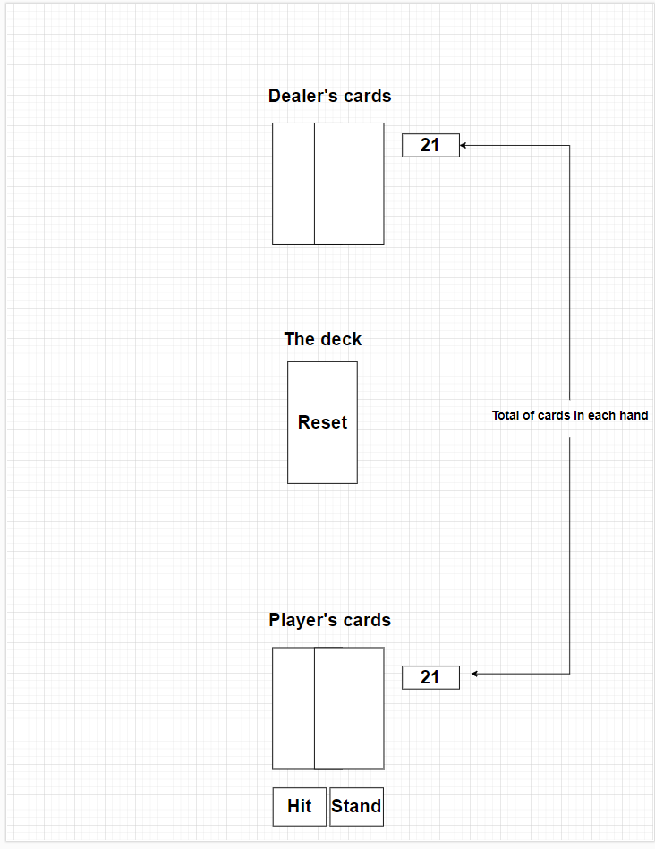

# BlackJack

Blackjack is a classic card game you where try to get 21 without going over.

# Rules

In Blackjack the goal is to beat the dealer by drawing cards and getting the closest to 21 without going over. Here are some ways to win:

• Get a blackjack (a total of 21) without the dealer also getting a blackjack.

• Get the closest to 21 and beating the dealer if they have a lower score than you.

• Let the dealer draw cards until they go over 21 (bust).

# Tech Stack

• HTML 

• CSS 

• JavaScript

# Wireframe

# MVP Goals

• Render game in browser.

• Show cards images in each hand

• Give 2 cards to the player and 2 cards to the dealer and hide the second card the dealer has.

• Ability to give one card to the player and add to the total if they click a hit button.

• Ability to have the player stand with a stand button.

• Include win/loss logic to tell if player beat the dealer or not.

• Reset the game by clicking on the deck of cards with the word reset on it when you hover over with mouse.

# Stretch Goals

• Shuffle animation when starting the game.

• Shuffle sounds and draw sounds.

• Have a noise play each time you start the game.

• Be able to bet chips

• Be able to double

• Have a chip total that you're able to add on to each time you win

# Potential Roadblocks

Not sure how to have ace be both a 1 and 11.

Adding Images for all cards.

Making Card total logic.

Making the win/loss logic.

Not sure where to add more card images when drawing.